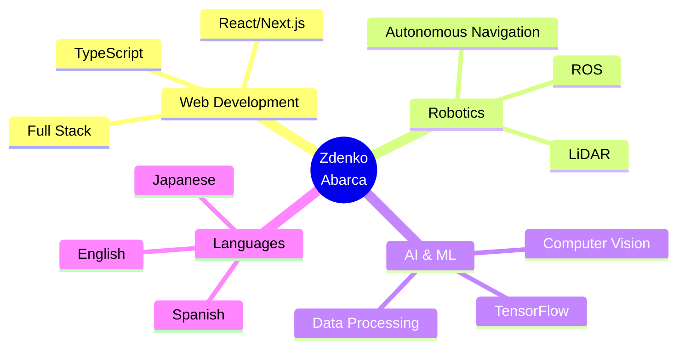

<div align="center">
  
</div>

<div align="center">
  <a href="https://git.io/typing-svg">
    
  </a>
</div>

<br/>

<div align="center">
  
  [](https://linkedin.com/in/zdenko-abarca)
  [](mailto:zdenko.abarca@example.com)
  [](https://zdenc0de.github.io)
  
  
  
</div>

---


###  Sobre Mí

```yaml
nombre: Zdenko Abarca
ubicacion: México 🇲🇽
educacion: Ingeniería en Computación
rol_actual: Full Stack Developer & Robotics Researcher
idiomas: [Español, Inglés, 日本語 (JLPT N4)]

intereses:
  - desarrollo_web: ["Next.js", "React", "TypeScript"]
  - robotica: ["ROS", "Navegación Autónoma", "LiDAR"]
  - ia: ["TensorFlow", "Computer Vision"]
  - hardware: ["Optimización de PC", "Arquitectura de Computadoras"]
  
actualmente_aprendiendo: "Japonés (JLPT N4) + Creando mi propia app 🇯🇵"
dato_curioso: "Optimizo PCs gaming y diseño simuladores de arquitectura"
```

<br clear="right"/>

---

## 🚀 Proyectos Destacados

<div align="center">

| 🏪 E-Commerce & Social | 🤖 Robotics & AI | 🎓 Learning Tools |
|:--:|:--:|:--:|
| **[try-on](https://github.com/zdenc0de/try-on)** <br/> Social Commerce con prueba virtual <br/> `Next.js` `Supabase` `TypeScript` | **Navegación Autónoma** <br/> LiDAR Mapping & Path Planning <br/> `ROS` `C++` `Python` | **App JLPT N4** <br/> Aprendizaje de Japonés <br/> `React` `Vite` `Tailwind` |
| [](https://github.com/zdenc0de/try-on) | 🔬 Programa Delfín 2025 | 🚧 En Desarrollo |

</div>

---

## 🛠️ Stack Tecnológico

<details open>
<summary><b>🎨 Frontend Development</b></summary>
<br/>


</details>

<details open>
<summary><b>⚙️ Backend & Database</b></summary>
<br/>


</details>

<details open>
<summary><b>🤖 Robotics & AI</b></summary>
<br/>


</details>

<details open>
<summary><b>🔧 Tools & Others</b></summary>
<br/>


</details>

---

## 🎓 Experiencia & Logros

<table>
<tr>
<td width="50%">

### 🔬 Programa Delfín 2025
**Investigación en Robótica**
- Desarrollo de sistema de navegación autónoma
- Implementación con LiDAR y ROS
- Algoritmos de path planning

</td>
<td width="50%">

### 🏆 Samsung Innovation Campus
**IA & Machine Learning**
- Detección médica con TensorFlow
- Computer Vision aplicada
- Python para procesamiento de datos

</td>
</tr>
</table>

---

## 📊 GitHub Analytics

<div align="center">
  
  
</div>

<div align="center">
  
  
</div>

<br/>

<div align="center">
  
</div>

---

## 🏆 GitHub Trophies

<div align="center">
  
</div>

---

## 💻 Weekly Development Breakdown

<!--START_SECTION:waka-->
```text
TypeScript   12 hrs 30 mins  ███████████░░░░░░  45.2%
Python        8 hrs 15 mins  ████████░░░░░░░░░  29.8%
C++           4 hrs 20 mins  ████░░░░░░░░░░░░░  15.7%
Markdown      1 hr 45 mins   █░░░░░░░░░░░░░░░░   6.3%
Other         0 hrs 50 mins  ░░░░░░░░░░░░░░░░░   3.0%
```
<!--END_SECTION:waka-->

---

## 🌟 Featured Skills

<div align="center">



</div>

---

## 🐍 Contribution Snake

<picture>
  <source media="(prefers-color-scheme: dark)" srcset="https://raw.githubusercontent.com/zdenc0de/zdenc0de/output/github-contribution-grid-snake-dark.svg">
  <source media="(prefers-color-scheme: light)" srcset="https://raw.githubusercontent.com/zdenc0de/zdenc0de/output/github-contribution-grid-snake.svg">
  
</picture>

---

## 📫 Conectemos

<div align="center">
  
  ### 💬 ¡Siempre abierto a nuevas oportunidades y colaboraciones!
  
  <a href="https://linkedin.com/in/zdenko-abarca">
    
  </a>
  <a href="mailto:zdenko.abarca@example.com">
    
  </a>
  <a href="https://zdenc0de.github.io">
    
  </a>
  
  <br/><br/>
  
  **"La tecnología es mejor cuando une a las personas y simplifica sus vidas"** 🚀
  
</div>

---

<div align="center">
  
</div>
