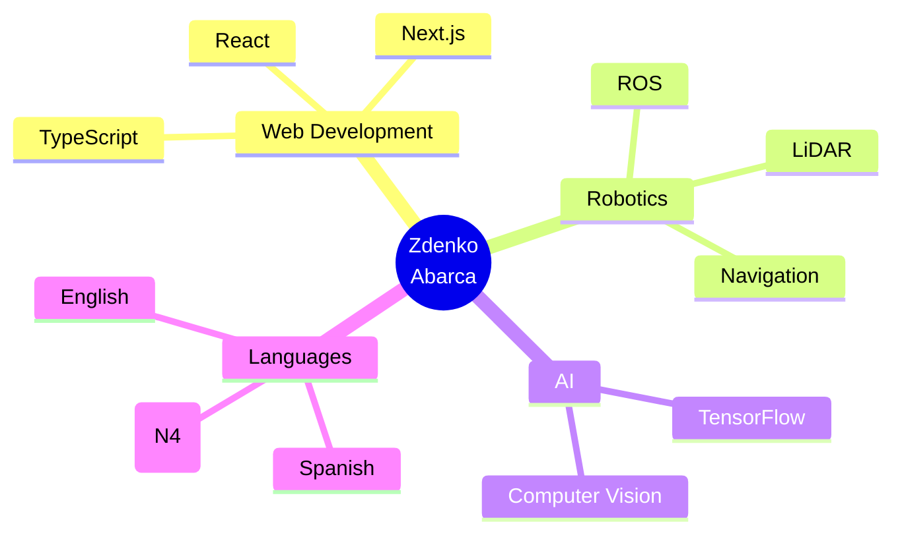

<div align="center">
  
</div>

<div align="center">
  
</div>

<br/>

<div align="center">
  
[](https://linkedin.com/in/zdenko-abarca)
[](https://zdenc0de.github.io)
[](mailto:zdenko.abarca@example.com)


</div>

---

## 👋 Sobre Mí
```yaml
nombre: Zdenko Abarca
ubicacion: México 🇲🇽
rol: Full Stack Developer & Robotics Researcher
educacion: Ingeniería en Computación
idiomas: [Español, Inglés, 日本語 (N4)]

enfoque_actual:
  - Web Full Stack con Next.js + TypeScript
  - Sistemas de Navegación Autónoma con LiDAR
  - IA aplicada a visión por computadora

actualmente_aprendiendo: "JLPT N4 + Arquitectura avanzada en Next.js"
curiosidad: "Me encanta optimizar PCs y crear simulaciones de robots"
```

---

## 🎯 Focus Areas (2025)

- 🌐 Desarrollo de aplicaciones full stack con **TypeScript**
- 🤖 Percepción y navegación autónoma usando **LiDAR + ROS**
- 🧠 Proyectos de **IA y Computer Vision**
- 📚 Creación de herramientas para aprendizaje (JLPT App)

---

## 🚀 Proyectos Destacados

### 🛍️ try-on — Social Commerce + Virtual Try-On
Plataforma social con interacción visual y prueba virtual.  
**Tech:** Next.js, TypeScript, Supabase  
🔗 [Ver Proyecto](https://github.com/zdenc0de/try-on)

### 🤖 Autonomous Navigation — Robotics Research (Programa Delfín 2025)
Pipeline de mapeo, localización y planeación con LiDAR.  
**Tech:** ROS, C++, Python

### 🇯🇵 JLPT N4 Learning App
Aplicación interactiva para estudiar japonés (en desarrollo).  
**Tech:** React, Vite, Tailwind CSS

---

## 🛠️ Stack Tecnológico

### 🎨 Frontend


### ⚙️ Backend & Database


### 🤖 Robótica & AI


---

## 📊 GitHub Analytics

<div align="center">
  
  
</div>

<br/>

<div align="center">
  
</div>

---

## 🌟 Skills Overview

<div align="center">


</div>

---

## 🐍 Contribution Snake

<div align="center">
  <picture>
    <source media="(prefers-color-scheme: dark)" srcset="https://raw.githubusercontent.com/zdenc0de/zdenc0de/output/github-contribution-grid-snake-dark.svg">
    <source media="(prefers-color-scheme: light)" srcset="https://raw.githubusercontent.com/zdenc0de/zdenc0de/output/github-contribution-grid-snake.svg">
    
  </picture>
</div>

---

## 📫 Conectemos

<div align="center">

### 💬 Abierto a colaboraciones y oportunidades

[](https://linkedin.com/in/zdenko-abarca)
[](mailto:zdenko.abarca@example.com)
[](https://zdenc0de.github.io)

<br/><br/>

**"La tecnología es mejor cuando une a las personas y transforma su mundo."** 🚀

</div>

<div align="center">
  
</div>
