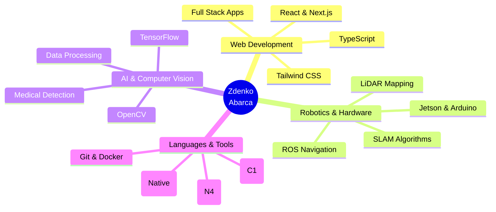

<div align="center">
  
</div>

<div align="center">
  <a href="https://git.io/typing-svg">
    
  </a>
</div>

<br/>

<div align="center">
  <a href="https://linkedin.com/in/zdenko-abarca" aria-label="LinkedIn">
    
  </a>
  <a href="https://zdenc0de.github.io" aria-label="Portfolio">
    
  </a>
  <a href="mailto:zdenko.abarca@example.com" aria-label="Email">
    
  </a>
  
</div>

<br/>

<div align="center">
<table border="0" width="100%">
<tr>
<td width="55%" valign="top">

### 👨‍💻 Sobre mí
```yaml
user: zdenc0de
location: México 🇲🇽
role: Full Stack & Robotics Researcher
languages:
  - Español (Native)
  - English (C1)
  - 日本語 (N4 Loading...)

current_focus:
  - "Next.js + TypeScript Ecosystem"
  - "Autonomous Navigation (LiDAR/ROS)"
  - "Computer Vision & AI"

fun_fact:
  - "I simulate CPU pipelines for fun"
  - "PC Hardware Optimizer"
```

</td>
<td width="45%" align="center" valign="middle">
  
</td>
</tr>
</table>
</div>

---

<h2 align="center">🛠️ Stack Tecnológico</h2>

<div align="center">

**Frontend & Mobile**


**Backend & Database**


**Robotics, AI & Tools**


</div>

---

<h2 align="center">🚀 Proyectos Destacados</h2>

<div align="center">
<table border="0" width="100%">
<tr>
<td width="33%" align="center" valign="top">

### 🛍️ **try-on**
**Social Commerce & Virtual Try-On**


Plataforma de prueba virtual e interacción social con características de e-commerce moderno.


[**Explorar Repo →**](https://github.com/zdenc0de/try-on)

</td>
<td width="33%" align="center" valign="top">

### 🤖 **Autonomous Bot**
**Delfín Research 2025**


Pipeline completo de navegación autónoma con SLAM, mapeo LiDAR y path planning.


[**Ver Investigación →**](#)

</td>
<td width="33%" align="center" valign="top">

### 🇯🇵 **Nihongo App**
**JLPT N4 Learning Tool**


App interactiva para el estudio de gramática japonesa, Kanji y vocabulario N4.


[**Ver Demo →**](#)

</td>
</tr>
</table>
</div>

---

<h2 align="center">🏆 Experiencia Académica</h2>

<table width="100%" border="0">
<tr>
<td width="50%" valign="top">

### 🔬 **Programa Delfín 2025**
#### Robotics Research Intern

- ✅ Desarrollo de navegación autónoma con **ROS**
- ✅ Implementación de algoritmos de **Path Planning**
- ✅ Integración de sensores **LiDAR** en Jetson Nano
- ✅ Mapeo y localización con **SLAM**

**Tech Stack:** ROS, C++, Python, LiDAR

</td>
<td width="50%" valign="top">

### 🎓 **Samsung Innovation Campus**
#### AI & Machine Learning Fellow

- ✅ Detección médica usando **TensorFlow**
- ✅ Computer Vision y procesamiento de datos
- ✅ Fundamentos de Redes Neuronales
- ✅ Certificación en Big Data e IA

**Tech Stack:** Python, TensorFlow, Pandas

</td>
</tr>
</table>

---

<h2 align="center">📊 Estadísticas de GitHub</h2>

<div align="center">
  
  
</div>

<div align="center">
  
  
</div>

---

<h2 align="center">🐍 Contribution Activity</h2>

<div align="center">
  <picture>
    <source media="(prefers-color-scheme: dark)" srcset="https://raw.githubusercontent.com/zdenc0de/zdenc0de/output/github-contribution-grid-snake-dark.svg">
    <source media="(prefers-color-scheme: light)" srcset="https://raw.githubusercontent.com/zdenc0de/zdenc0de/output/github-contribution-grid-snake.svg">
    
  </picture>
</div>

---

<h2 align="center">💼 Skills Overview</h2>

<div align="center">


</div>

---

<h2 align="center">📫 Conectemos</h2>

<div align="center">

### 💬 Siempre abierto a nuevas oportunidades y colaboraciones

[](https://linkedin.com/in/zdenko-abarca)
[](mailto:zdenko.abarca@example.com)
[](https://zdenc0de.github.io)

<br/>

_"La tecnología es mejor cuando une a las personas y transforma su mundo."_ 🚀

</div>

<div align="center">
  
</div>
